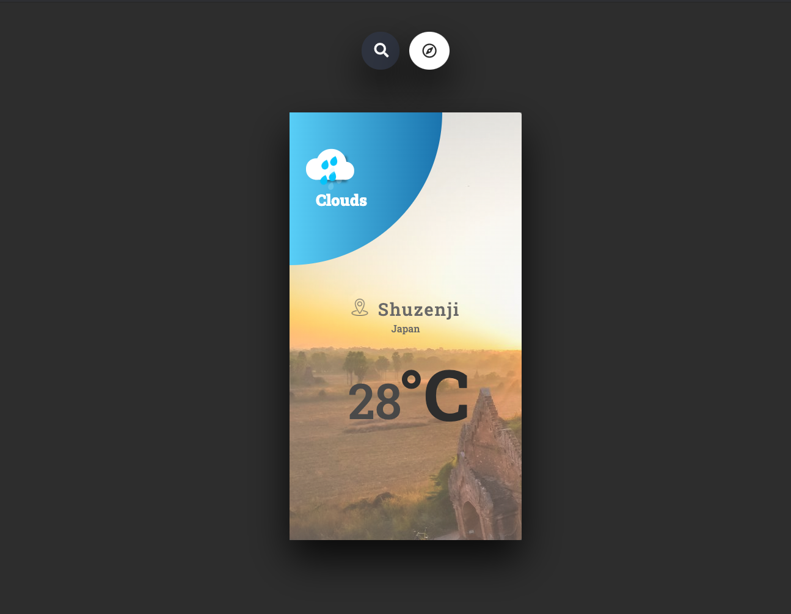

 
  <h3 align="center">Weathery</h3>

  

    World Weather App Design and Minimalist Concept
     
     
    <a href="https://konyan.github.io/weather-app/index.html">View Demo</a>
  

## About The Project

Let’s use what we’ve learned and take a chance to continue practicing DOM manipulation by dynamically rendering a simple Weather App! By the end, we are going to be using JavaScript and Ajax call with JSON and alone to generate the entire contents of the website!

### Built With

For the whole project, I used following tools and language.

- [HTML]()
- [CSS]()
- [Javasript]()
- [Es6]()
- [WebPack](https://webpack.js.org/)

<!-- CONTACT -->

## Contact

👤 **KoNyan**

- Github: [GitHub](https://github.com/konyan)
- Twitter: [Twitter](https://www.linkedin.com/in/nyanlintun/)
- Linkedin: [Linkedin](https://twitter.com/devkonyan)

<!-- SUPPORT -->

## Show your support

Give a ⭐️ if you like this project!

<!-- ACKNOWLEDGEMENTS -->

## Acknowledgements

Thanks to

- [CSS Tricks](https://css-tricks.com/controlling-css-animations-transitions-javascript/)
